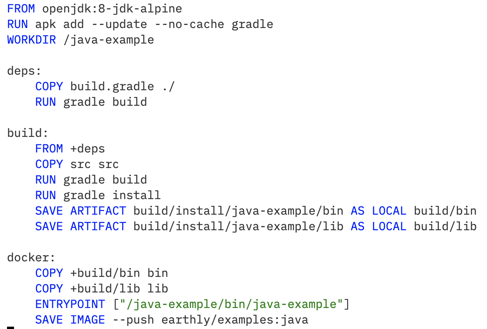

# earthly-mode

Major mode for editing Earthly Earthfile (https://docs.earthly.dev/docs/earthfile) developed
by [@wingyplus](https://github.com/wingyplus), [@TheCoreMan](https://github.com/TheCoreMan) and [@duck1123](https://github.com/duck1123)

## Current features

* Syntax highlighting support.
* Toggle comment.

## Installation Notes

### use-package

If you're using `use-package`, you can do:

```elisp
(use-package
  :ensure t)
```

### Manual

Add this major mode to `load-path` using `add-to-list`:

```elisp
(add-to-list 'load-path "path/to/major/mode")
```

## Screenshot


